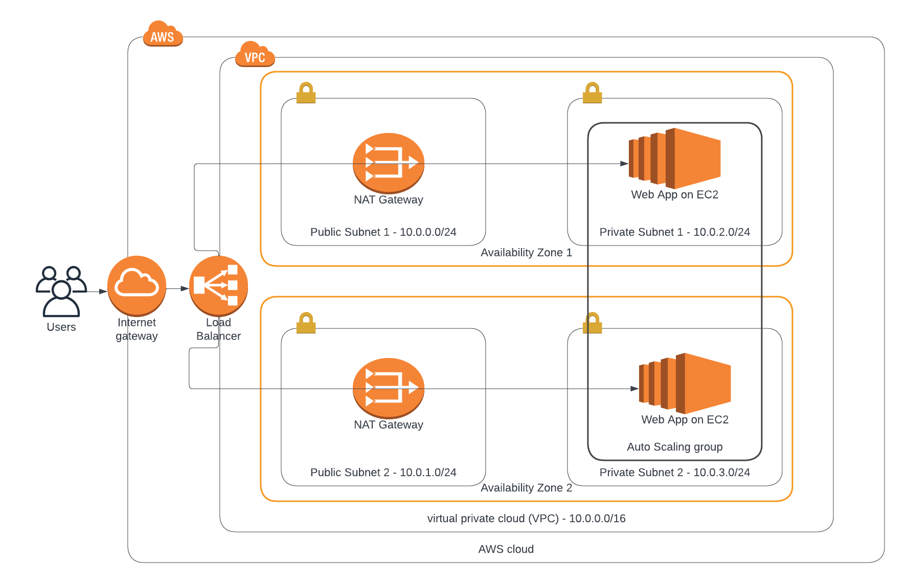
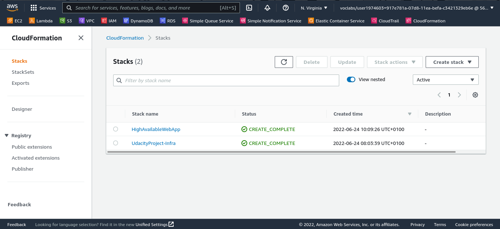
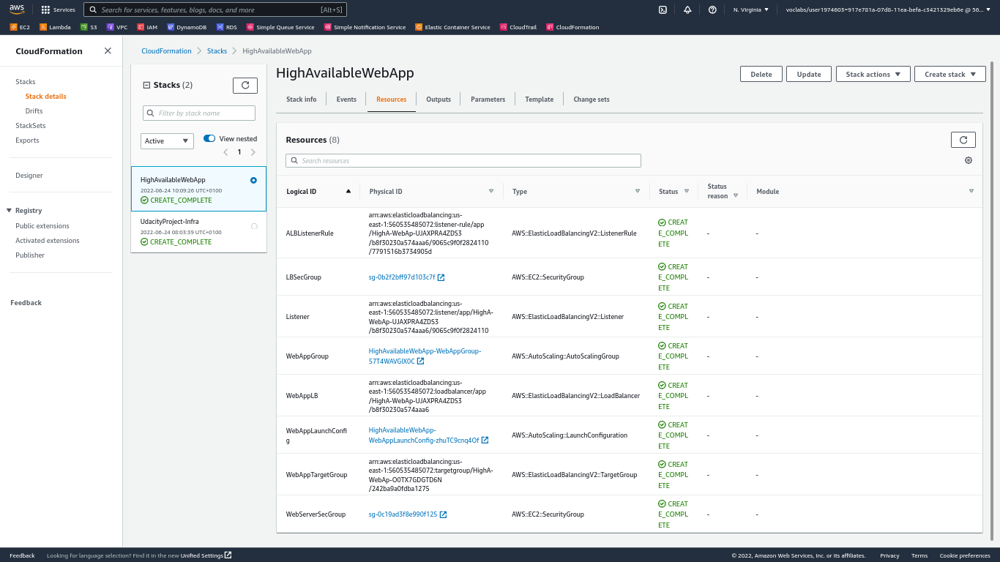
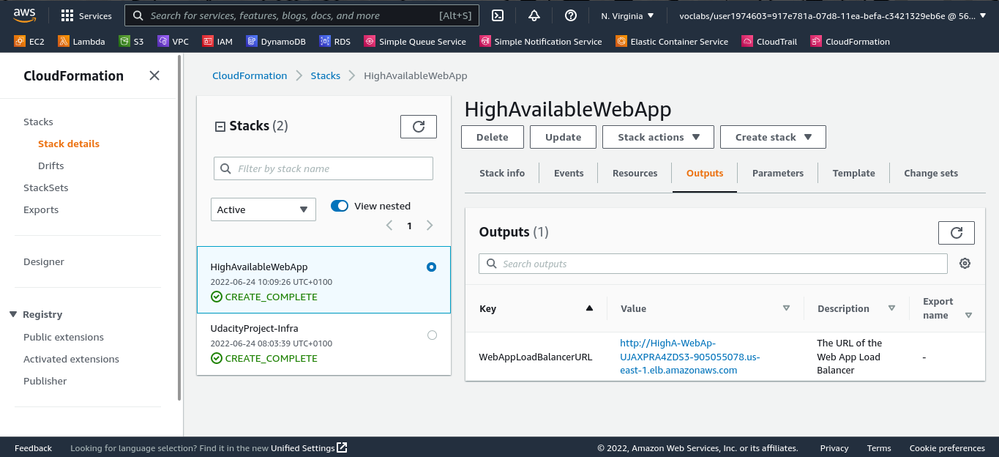
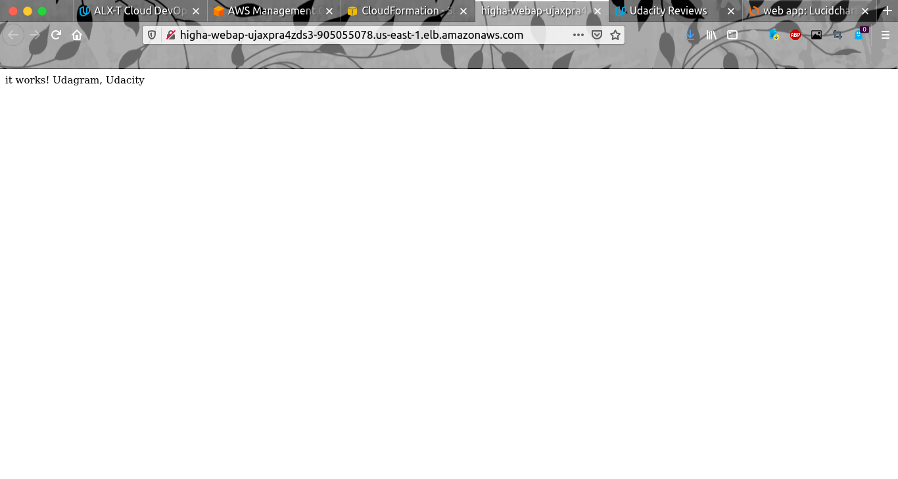

# Deploy a high-availability web app using CloudFormation

The aim of this project is to deploy web servers for a highly available web app using CloudFormation, starting with deploying the networking components, followed by servers, security roles and software.

## Scenario

Your company is creating an Instagram clone called Udagram.

Developers want to deploy a new application to the AWS infrastructure.

You have been tasked with provisioning the required infrastructure and deploying a dummy application, along with the necessary supporting software.

This needs to be automated so that the infrastructure can be discarded as soon as the testing team finishes their tests and gathers their results.

## Server specs

You'll need to create a Launch Configuration for your application servers in order to deploy four servers, two located in each of your private subnets. The launch configuration will be used by an auto-scaling group.

You'll need two vCPUs and at least 4GB of RAM. The Operating System to be used is Ubuntu 18. So, choose an Instance size and Machine Image (AMI) that best fits this spec.

Be sure to allocate at least 10GB of disk space so that you don't run into issues.

## Security Groups and Roles
1. Udagram communicates on the default HTTP Port: 80, so your servers will need this inbound port open since you will use it with the Load Balancer and the Load Balancer Health Check. As for outbound, the servers will need unrestricted internet access to be able to download and update their software.

2. The load balancer should allow all public traffic (0.0.0.0/0) on port 80 inbound, which is the default HTTP port. Outbound, it will only be using port 80 to reach the internal servers.

3. The application needs to be deployed into private subnets with a Load Balancer located in a public subnet.

4. One of the output exports of the CloudFormation script should be the public URL of the LoadBalancer. Bonus points if you add http:// in front of the load balancer DNS Name in the output, for convenience.

